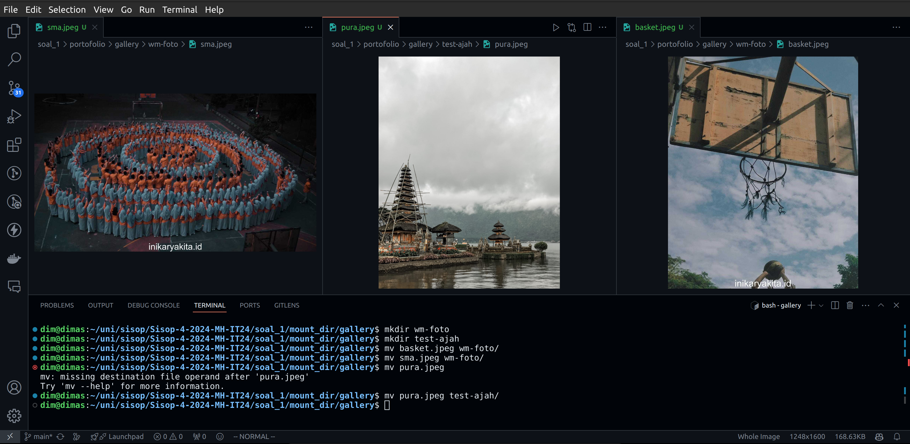
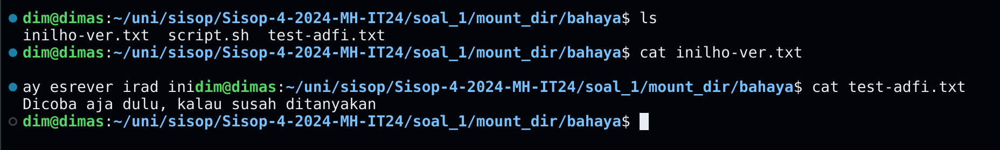
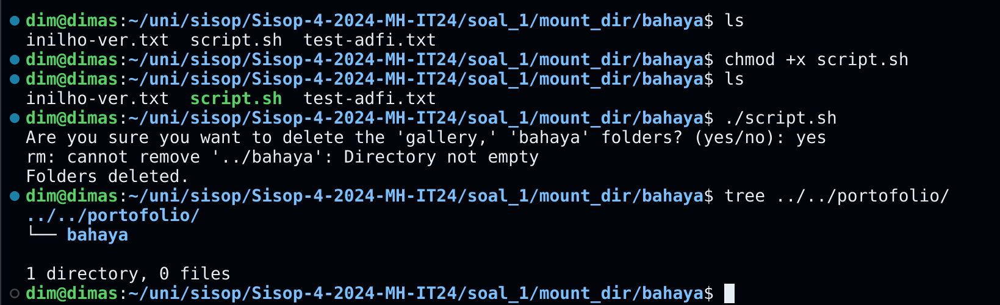

# Sisop Praktikum Modul 4-2024-MH-IT 24

Anggota Kelompok:

- Dimas Andhika Diputra 5027231074
- Mochamad Fadhil Saifullah 5027231068
- Thio Billy Amansyah 5027231007

# Soal 1 - inikaryakita.c
pada soal ini kita perlu buat function yang utamanya untuk move `mv` dan `cat` yang dimofikasi seperti berikut:
- untuk move `mv` kita perlu modifikasi jika move gambar ke folder yang namanya terdapat `wm` maka beri watermark terlebih dahulu untuk gambar tersebut
- untuk `cat` kita perlu modifikasi jika nama file yang mau kita tampilkan mengandung `test` maka yang kita tampilkan adalah reverse dari isi filenya, jika tidak mengandung `test` kita perlu tampilkan isi file seperti biasa apa adanya

untuk folder testcasenya kita diperlukan untuk mencari di halaman web `inikaryakita.id` bagian `service/fotografi`:


strukturnya sendiri seperti:
```
portofolio/
├── bahaya
│   ├── inilho-ver.txt
│   ├── script.sh
│   └── test-adfi.txt
└── gallery
    ├── basket.jpeg
    ├── cafe.jpeg
    ├── cafelagi.jpeg
    ├── cookie.jpeg
    ├── drangka.jpg
    ├── laut.jpeg
    ├── mrt.jpeg
    ├── naspad.JPG
    ├── pura.jpeg
    └── sma.jpeg
```

di sini saya bagi menjadi 3 fungsionalitas:
- fungsi umum command line
- fungsi command line untuk folder gallery `mv`
- fungsi command line untuk folder bahaya `chmod` dan `cat`

## Fungsi Umum Command Line
di sini saya pakai template fungsi umum dari discord yang dikirim oleh mas zidan
```c
static int hello_getattr(const char *path, struct stat *stbuf, struct fuse_file_info *fi) {
    char fpath[1000];
    sprintf(fpath,"%s%s",dirpath,path);
    int res;

    res = lstat(fpath, stbuf);
    if (res == -1)
        return -errno;

    return 0;
}

static int hello_mkdir(const char *path, mode_t mode) {
    char fpath[1000];
    sprintf(fpath,"%s%s",dirpath,path);
    int res;

    res = mkdir(fpath, mode);
    if (res == -1)
        return -errno;

    return 0;
}

static int hello_rmdir(const char *path) {
    char fpath[1000];
    sprintf(fpath,"%s%s",dirpath,path);
    int res = rmdir(fpath);
    if (res == -1) {
        return -errno;
    }
    return 0;
}

static int hello_readdir(const char *path, void *buf, fuse_fill_dir_t filler, off_t offset, struct fuse_file_info *fi) {
    char fpath[1000];
    sprintf(fpath,"%s%s",dirpath,path);

    DIR *dp;
    struct dirent *de;

    dp = opendir(fpath);

    while ((de = readdir(dp)) != NULL) {
        struct stat st;
        memset(&st, 0, sizeof(st));
        st.st_ino = de->d_ino;
        st.st_mode = de->d_type << 12;
        if (filler(buf, de->d_name, &st, 0))
            break;
    }

    closedir(dp);
    return 0;
}
```
untuk dirpath nya sendiri saya set ke folder portofolio tentunya

## Fungsi CLI untuk folder Gallery
untuk folder gallery fungsi yang diperlukan hanya `mv`, di sini dimodifikasi jika folder tujuannya mengandung nama `wm` beri watermark terlebih dahulu

```c
static int hello_rename(const char *from, const char *to, unsigned int flags) {
    char fromPath[1000], toPath[1000];
    sprintf(fromPath,"%s%s",dirpath,from);
    sprintf(toPath,"%s%s",dirpath,to);

    if (strstr(to, "/wm") != NULL) {
        char command[1000];
        sprintf(command, "convert -gravity south -font Arial '%s' -fill white -pointsize 50 -annotate +0+0 '%s' '%s'", fromPath, "inikaryakita.id", toPath);
        system(command);

        if (unlink(fromPath) == -1) {
            perror("Error: Failed to remove the source file.");
            return -errno;
        }
    } else {
        if (rename(fromPath, toPath) == -1) {
            perror("gabisa move");
            return -errno;
        }
    } 
    // sprintf(command, "convert %s -font Arial -pointsize 20 -draw \"gravity south fill black text 0,12 'inikaryakita.id' fill white text 1,11 'inikaryakita.id'\" %s", frompath, temp);
    return 0;
}
```

di sini saya menggunakan library `imagemagick` yang mana penggunaan sebenarnya menggunakan command line, karena perlu dijalankan melalui program c, saya menggunakan fungsi `system` pada kodenya. Untuk command `imagemagick`nya sendiri seperti:

```
convert -gravity south -font Arial '%s' -fill white -pointsize 50 -annotate +0+0 '%s' '%s'"
```

pada kode itu ada 3 %s:
- pertama diisi dengan frompath (path awal)
- kedua diisi dengan tulisan watermarknya
- ketiga diisi dengan topath (path tujuan)

## Fungsi CLI untuk folder Bahaya
di sini saya bagi lagi menjadi 2 yaitu fungsionalitas untuk `script.sh` dan untuk reverse isi teks

### Fungsionalitas Script.sh
untuk fungsi script.sh ini hanya 2 yaitu `chmod` untuk buat filenya executable, lalu ada unlink untuk fungsi `rm` yang ada di dalam file `script.sh`nya itu sendiri

```c
static int hello_unlink(const char *path) {
    char fpath[1000];
    sprintf(fpath,"%s%s",dirpath,path);
    int res = unlink(fpath);
    return 0;
}

static int hello_chmod(const char *path, mode_t mode) {
    char fpath[1000];
    sprintf(fpath,"%s%s",dirpath,path);
    if(chmod(fpath, mode) < 0)
        return -errno;
    return 0;
}
```

### Fungsionalitas reverse teks
di sini hanya ada 1 fungsi yang dibuat untuk `cat`, di dalamnya mirip seperti fungsi `mv` ada pengondisian nama file yang akan di tampilkan isinya

```c
static int hello_read(const char *path, char *buf, size_t size, off_t offset, struct fuse_file_info *fi) {
    char fpath[1000];
    sprintf(fpath,"%s%s",dirpath,path);

    // Check if the file has a 'test' prefix
    const char *filename = strrchr(path, '/');
    if (filename == NULL) {
        filename = path;
    } else {
        filename++;
    }

    if (strncmp(filename, "test", 4) == 0) {
        // If the file has a 'test' prefix, reverse the words in the lines before output
        FILE *file = fopen(fpath, "r");

        char line[1024];
        buf[0] = '\0';  // Initialize the buffer to an empty string
        while (fgets(line, sizeof(line), file) != NULL) {
            size_t len = strlen(line);
            if (line[len - 1] == '\n') {
                line[len - 1] = '\0';
            }

            // Reverse the characters in each word
            char *start = line;
            char *end = start + strlen(line) - 1;
            while (end > start) {
                char temp = *start;
                *start = *end;
                *end = temp;
                start++;
                end--;
            }

            // Check if the buffer is large enough
            if (strlen(buf) + strlen(line) + 1 > size) {
                fclose(file);
                return -ENOMEM;
            }

            strcat(buf, line);
            strcat(buf, "\n");
        }

        fclose(file);
    } else {
        // If the file doesn't have a 'test' prefix, output normally
        int fd = open(fpath, O_RDONLY);
        int res = pread(fd, buf, size, offset);

        close(fd);
        return res;
    }

    return strlen(buf);
}
```

## Kendala yang dialami
-- 

## Screenshots
hasil di folder gallery:

hasil reverse teks (jika filename mengandung `test`) (folder bahaya):

hasil chmod script, dan run script:


> di situ terlihat ada cannot remove bahaya karena ada file hidden di folder bahaya yang mana tidak terdeksi di filesystem, jadi memang tidak ter-remove bukan karena error. Selain itu pun berhasil terremove

# Soal 2 - pastibisa.c
1. Define FUSE Version

#define FUSE\_USE\_VERSION 31

Mendefinisikan FUSE versi 31

1. Menyertakan Header

   #include <fuse.h>

   #include <stdio.h>

   #include <stdlib.h>

   #include <string.h>

   #include <unistd.h>

   #include <fcntl.h>

   #include <errno.h>

   #include <sys/types.h>

   #include <sys/stat.h>

   #include <time.h>

   #include <dirent.h>

   #include <libgen.h>

1. Logging Function

   void log\_action(const char \*status, const char \*tag, const char \*information) {

   `    `FILE \*log\_file = fopen("logs-fuse.log", "a");

   `    `if (log\_file) {

   `        `time\_t now = time(NULL);

   `        `struct tm \*t = localtime(&now);

   `        `fprintf(log\_file, "[%s]::%02d/%02d/%04d-%02d:%02d:%02d::[%s]::[%s]\n",

   `                `status,

   `                `t->tm\_mday, t->tm\_mon + 1, t->tm\_year + 1900,

   `                `t->tm\_hour, t->tm\_min, t->tm\_sec,

   `                `tag, information);

   `        `fclose(log\_file);

   `    `}

   }

   Fungsi ini berguna untuk mencatat tindakan ke dalam file log dengan format yang mencakup waktu saat ini, status, tag, dan informasi.

1. Base64 Decode Function

   void base64\_decode(const char \*encoded, char \*decoded) {

   `    `FILE \*pipe = popen("echo -n | base64 -d", "r");

   `    `fwrite(encoded, 1, strlen(encoded), pipe);

   `    `pclose(pipe);

   }

   Disini saya menambahkan fungsi untuk mendekode teks yang dikodekan dengan Base64 menggunakan perintah shell base64 -d.

1. ROT13 Decode Function

   void rot13\_decode(char \*text) {

   `    `for (int i = 0; text[i]; i++) {

   `        `if ('a' <= text[i] && text[i] <= 'z') {

   `            `text[i] = 'a' + (text[i] - 'a' + 13) % 26;

   `        `} else if ('A' <= text[i] && text[i] <= 'Z') {

   `            `text[i] = 'A' + (text[i] - 'A' + 13) % 26;

   `        `}

   `    `}

   }

   Disini saya menggunakan fungsi untuk mendekode teks yang dikodekan dengan ROT13, di mana setiap huruf digeser 13 posisi dalam alfabet.

1. Hex Decode Function

   int hex\_value(char c) {

   `    `if ('0' <= c && c <= '9') return c - '0';

   `    `if ('a' <= c && c <= 'f') return c - 'a' + 10;

   `    `if ('A' <= c && c <= 'F') return c - 'A' + 10;

   `    `return -1;

   }

   void hex\_decode(const char \*encoded, char \*decoded) {

   `    `while (\*encoded && encoded[1]) {

   `        `\*(decoded++) = (char)((hex\_value(\*encoded) << 4) | hex\_value(encoded[1]));

   `        `encoded += 2;

   `    `}

   `    `\*decoded = '\0';

   }

   Fungsi ini untuk mendekode teks yang dikodekan dalam format hexadecimal.

1. Reverse Text Function

   void reverse\_text(char \*text) {

   `    `int len = strlen(text);

   `    `for (int i = 0; i < len / 2; i++) {

   `        `char temp = text[i];

   `        `text[i] = text[len - i - 1];

   `        `text[len - i - 1] = temp;

   `    `}

   }

   Disni saya menambahkan fungsi untuk membalikkan teks

1. Construct Path Function

   static char \*construct\_path(const char \*path) {

   `    `static char full\_path[512];

   `    `snprintf(full\_path, sizeof(full\_path), "%s%s", "/home/fadhils/inikaryakita/pesan", path);

   `    `return full\_path;

   }

   Fungsi ini berguna untuk menambahkan path yang diberikan ke path dasar /home/fadhils/inikaryakita/pesan.

1. Authentication Variables

   static const char \*correct\_password = "Sempol";

   static int authenticated = 0;

   Disini saya menambahkan variabel untuk menyimpan password

1. Filesystem Operations

   Berikut adalah bagian Filesystem Operations:

   Getattr Function

   static int fs\_getattr(const char \*path, struct stat \*stbuf, struct fuse\_file\_info \*fi) {

   `    `(void) fi;

   `    `int res;

   `    `char \*full\_path = construct\_path(path);

   `    `res = lstat(full\_path, stbuf);

   `    `if (res == -1)

   `        `return -errno;

   `    `return 0;

   }

   Fungsi ini berguna untuk mendapatkan atribut sebuah file

   Readdir Function

   static int fs\_readdir(const char \*path, void \*buf, fuse\_fill\_dir\_t filler, off\_t offset, struct fuse\_file\_info \*fi, enum fuse\_readdir\_flags flags) {

   `    `(void) offset;

   `    `(void) fi;

   `    `DIR \*dp;

   `    `struct dirent \*de;

   `    `struct stat st;

   `    `char \*full\_path = construct\_path(path);

   `    `dp = opendir(full\_path);

   `    `if (dp == NULL)

   `        `return -errno;

   `    `while ((de = readdir(dp)) != NULL) {

   `        `memset(&st, 0, sizeof(st));

   `        `st.st\_ino = de->d\_ino;

   `        `st.st\_mode = de->d\_type << 12;

   `        `if (strcmp(de->d\_name, ".") == 0 || strcmp(de->d\_name, "..") == 0) {

   `            `continue;

   `        `}

   `        `if (filler(buf, de->d\_name, &st, 0, 0)) {

   `            `break;

   `        `}

   `    `}

   `    `closedir(dp);

   `    `return 0;

   }

   Fungsi ini berguna untuk membaca isi direktori

   Open Function

   static int fs\_open(const char \*path, struct fuse\_file\_info \*fi) {

   `    `if (strncmp(path, "/rahasia-berkas", 15) == 0 && !authenticated) {

   `        `log\_action("FAILED", "open", path);

   `        `return -EACCES;

   `    `}

   `    `int res;

   `    `char \*full\_path = construct\_path(path);

   `    `res = open(full\_path, fi->flags);

   `    `if (res == -1)

   `        `return -errno;

   `    `close(res);

   `    `return 0;

   }

   Fungsi ini berguna untuk membuka file dan memeriksa autentikasi untuk file rahasia.

   Read Function

   static int fs\_read(const char \*path, char \*buf, size\_t size, off\_t offset, struct fuse\_file\_info \*fi) {

   `    `if (strncmp(path, "/rahasia-berkas", 15) == 0 && !authenticated) {

   `        `log\_action("FAILED", "read", path);

   `        `return -EACCES;

   `    `}

   `    `int fd;

   `    `int res;

   `    `char \*full\_path = construct\_path(path);

   `    `fd = open(full\_path, O\_RDONLY);

   `    `if (fd == -1)

   `        `return -errno;

   `    `res = pread(fd, buf, size, offset);

   `    `if (res == -1)

   `        `res = -errno;

   `    `close(fd);

   `    `char \*filename = basename(full\_path);

   `    `if (strncmp(filename, "base64\_", 7) == 0) {

   `        `char decoded[1024];

   `        `base64\_decode(buf, decoded);

   `        `strcpy(buf, decoded);

   `    `} else if (strncmp(filename, "rot13\_", 6) == 0) {

   `        `rot13\_decode(buf);

   `    `} else if (strncmp(filename, "hex\_", 4) == 0) {

   `        `char decoded[1024];

   `        `hex\_decode(buf, decoded);

   `        `strcpy(buf, decoded);

   `    `} else if (strncmp(filename, "rev\_", 4) == 0) {

   `        `reverse\_text(buf);

   `    `}

   `    `log\_action("SUCCESS", "read", path);

   `    `return res;

   }

   Fungs ini  untuk membaca file. Memeriksa autentikasi dan mendekode konten file jika diperlukan.

1. FUSE Operations Structure

   static struct fuse\_operations fs\_oper = {

       .getattr = fs\_getattr,

       .readdir = fs\_readdir,

       .open = fs\_open,

       .read = fs\_read,

   };

   Disini saya menambahkan struktur yang mendefinisikan operasi FUSE yang diimplementasikan.

1. Main Function

   int main(int argc, char \*argv[]) {

   `    `umask(0);

   `    `char password[256];

   `    `printf("Enter password to access 'rahasia-berkas': ");

   `    `scanf("%255s", password);

   `    `if (strcmp(password, correct\_password) == 0) {

   `        `authenticated = 1;

   `        `log\_action("SUCCESS", "authenticate", "User authenticated successfully");

   `    `} else {

   `        `log\_action("FAILED", "authenticate", "User authentication failed");

   `    `}

   `    `return fuse\_main(argc, argv, &fs\_oper, NULL);

   }

   Disini saya menambahkan fungsi utama yang mengatur umask, meminta password dari pengguna, memeriksa autentikasi, dan menjalankan FUSE dengan operasi yang telah didefinisikan.

   Catatan: file ini belum berhasil dijalankan, kemungkinan error berada di bagian logging Function

# Soal_3 - archeolog.c

## Preface
Soal tidak dapat diselesaikan karena kesalahan pemahaman akan soal, namun saya akan berikan penjelasan akan apa yang telah saya kerjakan sesingkat mungkin.

## What-do
Tidak sesuai dengan soal. Tapi program yang telah saya buat akan membuat folder FUSE yang berisikan data utuh dari pecahan-pecahan sebuah data dari folder `relics`. Ada pula folder samba bernama `report` yang dapat membagikan hasil data ke device yang terhubung.

## Libraries
```
#include <fuse3/fuse.h>
#include <stdio.h>
#include <string.h>
#include <errno.h>
#include <unistd.h>
```
- `fuse.h` berisi deklarasi fungsi-fungsi yang akan dipanggil pada operasi yang dilakukan dalam filesystem (mkdir, copy, cat, etc..). Setiap operasi perlu dibuat fungsinya masing-masing untuk bekerja. Dokumentasi lanjut ada pada [repo](https://github.com/libfuse/libfuse/blob/master/example/passthrough.c) ini.
- `stdio.h` fungsi input/ouput biasa.
- `string.h` memanipulasi data string.
- `errno.h` banyak macros untuk berbagai jenis error. 
- `unistd.h` banyak fungsi dan macros yang digunakan oleh POSIX systems (Linux, UNIX, lalala..).

## Fungsi untuk Operasi FS
Dipanggil ketika melakukan FUSE operation. Error pada *debug mode* jika fungsi belum terdefinisi.
```
static const struct fuse_operations picat_oper = {
	.getattr	= picat_getattr,
	.readdir	= picat_readdir,
	.read		= picat_read,
};
```
- `getattr` memberikan informasi attribut pada file-file dalam direktori yang ditunjuk oleh binary 'archeolog'. Informasi seperti file premission, jumlah hardlinks, dan tipe file (file/direktori). 
- `readdir` membaca direktori serta bisa menambah file / direktori ketika user melihat direktori tersebut. 
- `read` membaca file dan menyatukan pecahan relics. Belum berhasil.

## Fungsi Utilitas
Fungsi yang membantu fungsi FUSE Operations.
```
size_t fsize(char *fname) 
{
	FILE *fp = fopen(fname, "r");
	fseek(fp, 0L, SEEK_END);
	size_t size = (size_t) ftell(fp);
	return size;
}

/* Tis one below Doesnt work. Segfault everytime and crashes 
 * the folder where binary is located. Proceed w/ caution 
 * and dont run on home. Fix w/ `fusermount -uz ./; mount ./;`
 * or the likes of that.
 */
void picat(char const *fname) 
{
	char destpath[50];
	snprintf(destpath, 50, "./test/%s", fname);
	FILE *dest;

	for(int i = 0; i <= 6; i++) {
		char pcname[18], pcpath[50];
		snprintf(pcname, 18, "%s.00%d", fname, i);
		snprintf(pcpath, 50, "./relics/%s", pcname);
		FILE *piece = fopen(pcpath, "rb");
		fseek(piece, 0, SEEK_SET);
		dest = fopen(destpath,"ab");
		int pclen = fsize(pcpath);
		for(int i = 0; i < pclen; i++)
			fputc(fgetc(piece), dest);
		fclose(piece);
	}
	
	fclose(dest); 
}
```
- `fsize` mengukur ukuran file dari input nama file tersebut.
- `picat` concatenate pecahan file dari folder `relics` ke folder yang ditunjuk dalam eksekusi binary file, folder `[nama bebas]`. 

## Fungsi Main
Modifikasi fungsi main dari `hello.c` pada [repo](https://github.com/libfuse/libfuse/blob/master/example/passthrough.c) yang direferensi. 
```
/* Dont touch also. Dunt understand, no time,
 * lack reference. Keep it running.
 */
int main(int argc, char *argv[])
{
	int ret;
	struct fuse_args args = FUSE_ARGS_INIT(argc, argv);

	ret = fuse_main(args.argc, args.argv, &picat_oper, NULL);
	fuse_opt_free_args(&args);
	return ret;
}
```
