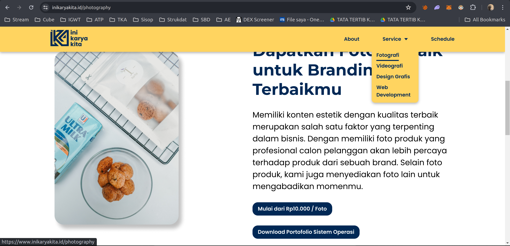

# Sisop Praktikum Modul 4-2024-MH-IT 24

Anggota Kelompok:

- Dimas Andhika Diputra 5027231074
- Mochamad Fadhil Saifullah 5027231068
- Thio Billy Amansyah 5027231007

# Soal 1 - inikaryakita.c
pada soal ini kita perlu buat function yang utamanya untuk move `mv` dan `cat` yang dimofikasi seperti berikut:
- untuk move `mv` kita perlu modifikasi jika move gambar ke folder yang namanya terdapat `wm` maka beri watermark terlebih dahulu untuk gambar tersebut
- untuk `cat` kita perlu modifikasi jika nama file yang mau kita tampilkan mengandung `test` maka yang kita tampilkan adalah reverse dari isi filenya, jika tidak mengandung `test` kita perlu tampilkan isi file seperti biasa apa adanya

untuk folder testcasenya kita diperlukan untuk mencari di halaman web `inikaryakita.id` bagian `service/fotografi`:


strukturnya sendiri seperti:
```
portofolio/
├── bahaya
│   ├── inilho-ver.txt
│   ├── script.sh
│   └── test-adfi.txt
└── gallery
    ├── basket.jpeg
    ├── cafe.jpeg
    ├── cafelagi.jpeg
    ├── cookie.jpeg
    ├── drangka.jpg
    ├── laut.jpeg
    ├── mrt.jpeg
    ├── naspad.JPG
    ├── pura.jpeg
    └── sma.jpeg
```

di sini saya bagi menjadi 3 fungsionalitas:
- fungsi umum command line
- fungsi command line untuk folder gallery `mv`
- fungsi command line untuk folder bahaya `chmod` dan `cat`

## Fungsi Umum Command Line
di sini saya pakai template fungsi umum dari discord yang dikirim oleh mas zidan
```c
static int hello_getattr(const char *path, struct stat *stbuf, struct fuse_file_info *fi) {
    char fpath[1000];
    sprintf(fpath,"%s%s",dirpath,path);
    int res;

    res = lstat(fpath, stbuf);
    if (res == -1)
        return -errno;

    return 0;
}

static int hello_mkdir(const char *path, mode_t mode) {
    char fpath[1000];
    sprintf(fpath,"%s%s",dirpath,path);
    int res;

    res = mkdir(fpath, mode);
    if (res == -1)
        return -errno;

    return 0;
}

static int hello_rmdir(const char *path) {
    char fpath[1000];
    sprintf(fpath,"%s%s",dirpath,path);
    int res = rmdir(fpath);
    if (res == -1) {
        return -errno;
    }
    return 0;
}

static int hello_readdir(const char *path, void *buf, fuse_fill_dir_t filler, off_t offset, struct fuse_file_info *fi) {
    char fpath[1000];
    sprintf(fpath,"%s%s",dirpath,path);

    DIR *dp;
    struct dirent *de;

    dp = opendir(fpath);

    while ((de = readdir(dp)) != NULL) {
        struct stat st;
        memset(&st, 0, sizeof(st));
        st.st_ino = de->d_ino;
        st.st_mode = de->d_type << 12;
        if (filler(buf, de->d_name, &st, 0))
            break;
    }

    closedir(dp);
    return 0;
}
```
untuk dirpath nya sendiri saya set ke folder portofolio tentunya

## Fungsi CLI untuk folder Gallery
untuk folder gallery fungsi yang diperlukan hanya `mv`, di sini dimodifikasi jika folder tujuannya mengandung nama `wm` beri watermark terlebih dahulu

```c
static int hello_rename(const char *from, const char *to, unsigned int flags) {
    char fromPath[1000], toPath[1000];
    sprintf(fromPath,"%s%s",dirpath,from);
    sprintf(toPath,"%s%s",dirpath,to);

    if (strstr(to, "/wm") != NULL) {
        char command[1000];
        sprintf(command, "convert -gravity south -font Arial '%s' -fill white -pointsize 50 -annotate +0+0 '%s' '%s'", fromPath, "inikaryakita.id", toPath);
        system(command);

        if (unlink(fromPath) == -1) {
            perror("Error: Failed to remove the source file.");
            return -errno;
        }
    } else {
        if (rename(fromPath, toPath) == -1) {
            perror("gabisa move");
            return -errno;
        }
    } 
    // sprintf(command, "convert %s -font Arial -pointsize 20 -draw \"gravity south fill black text 0,12 'inikaryakita.id' fill white text 1,11 'inikaryakita.id'\" %s", frompath, temp);
    return 0;
}
```

di sini saya menggunakan library `imagemagick` yang mana penggunaan sebenarnya menggunakan command line, karena perlu dijalankan melalui program c, saya menggunakan fungsi `system` pada kodenya. Untuk command `imagemagick`nya sendiri seperti:

```
convert -gravity south -font Arial '%s' -fill white -pointsize 50 -annotate +0+0 '%s' '%s'"
```

pada kode itu ada 3 %s:
- pertama diisi dengan frompath (path awal)
- kedua diisi dengan tulisan watermarknya
- ketiga diisi dengan topath (path tujuan)

## Fungsi CLI untuk folder Bahaya
di sini saya bagi lagi menjadi 2 yaitu fungsionalitas untuk `script.sh` dan untuk reverse isi teks

### Fungsionalitas Script.sh
untuk fungsi script.sh ini hanya 2 yaitu `chmod` untuk buat filenya executable, lalu ada unlink untuk fungsi `rm` yang ada di dalam file `script.sh`nya itu sendiri

```c
static int hello_unlink(const char *path) {
    char fpath[1000];
    sprintf(fpath,"%s%s",dirpath,path);
    int res = unlink(fpath);
    return 0;
}

static int hello_chmod(const char *path, mode_t mode) {
    char fpath[1000];
    sprintf(fpath,"%s%s",dirpath,path);
    if(chmod(fpath, mode) < 0)
        return -errno;
    return 0;
}
```

### Fungsionalitas reverse teks
di sini hanya ada 1 fungsi yang dibuat untuk `cat`, di dalamnya mirip seperti fungsi `mv` ada pengondisian nama file yang akan di tampilkan isinya

```c
static int hello_read(const char *path, char *buf, size_t size, off_t offset, struct fuse_file_info *fi) {
    char fpath[1000];
    sprintf(fpath,"%s%s",dirpath,path);

    // Check if the file has a 'test' prefix
    const char *filename = strrchr(path, '/');
    if (filename == NULL) {
        filename = path;
    } else {
        filename++;
    }

    if (strncmp(filename, "test", 4) == 0) {
        // If the file has a 'test' prefix, reverse the words in the lines before output
        FILE *file = fopen(fpath, "r");

        char line[1024];
        buf[0] = '\0';  // Initialize the buffer to an empty string
        while (fgets(line, sizeof(line), file) != NULL) {
            size_t len = strlen(line);
            if (line[len - 1] == '\n') {
                line[len - 1] = '\0';
            }

            // Reverse the characters in each word
            char *start = line;
            char *end = start + strlen(line) - 1;
            while (end > start) {
                char temp = *start;
                *start = *end;
                *end = temp;
                start++;
                end--;
            }

            // Check if the buffer is large enough
            if (strlen(buf) + strlen(line) + 1 > size) {
                fclose(file);
                return -ENOMEM;
            }

            strcat(buf, line);
            strcat(buf, "\n");
        }

        fclose(file);
    } else {
        // If the file doesn't have a 'test' prefix, output normally
        int fd = open(fpath, O_RDONLY);
        int res = pread(fd, buf, size, offset);

        close(fd);
        return res;
    }

    return strlen(buf);
}
```

## Kendala yang dialami
-- 

## Screenshots
hasil di folder gallery:

hasil reverse teks (jika filename mengandung `test`) (folder bahaya):

hasil chmod script, dan run script:


> di situ terlihat ada cannot remove bahaya karena ada file hidden di folder bahaya yang mana tidak terdeksi di filesystem, jadi memang tidak ter-remove bukan karena error. Selain itu pun berhasil terremove


